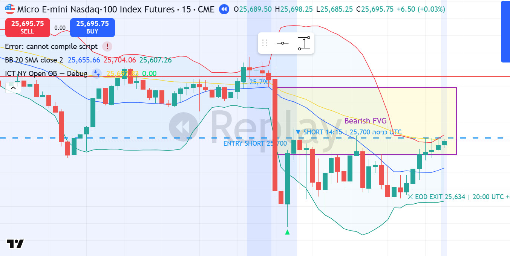

# MNQ1! SHORT — 08.01.2026 [Replay Simulation]

## פרמטרים
- Entry: 25,700 | SL: 25,790 | TP1: 25,440 | TP2: 25,287
- R:R מתוכנן: 2.9:1 | סיכון: ~0.73% קפיטל דמו
- חוזים: 2 | Timeframe ביצוע: 15M | Kill Zone: NY Open (13:30 UTC)
- סוג כניסה: Limit Order — Bearish FVG Fill
- כניסה בשעה: 14:15 UTC | 09:15 ET
- יציאה בשעה: 20:00 UTC | 15:00 ET — EOD Close (כלל 23:00 IL)

## P&L
- סגירה: **EOD** במחיר 25,634
- חוזים: **2 MNQ** | רווח: 66 נק' × $2 × 2 = **+$264**
- נקודות: **+66 נק'**
- R realized: **+0.74R** (WIN קטן — TP1 לא הגיע בזמן EOD)
- שווי תיק אחרי עסקה: **$49,784**

## ניתוח שהוביל להחלטה

**מאקרו (4H):**
- Bias: BEARISH — CHoCH מאושר מ-2 ינואר
- Jan 2: BSL Sweep ב-25,803 → ירידה חדה ל-25,265 בנפח 927K (BOS דובי)
- מחיר מתחת ל-SMA20 ב-4H
- 50% ריינג': 25,534 — מחיר בDiscoumt Zone

**מבנה (1H):**
- Bearish OB: 25,638–25,803 (הנר השורי האחרון לפני הנפילה)
- מחיר בDiscoumt Zone יחסית לריינג' הגדול

**ביצוע (15M):**
- NY Open Bar (13:30 UTC): O:25,786 → H:25,802 → L:25,613 → C:25,622. נפח 153K (vs ממוצע 5K) — Institutional Displacement
- Bearish FVG שנוצר: 25,676–25,774
- כניסה SHORT בחזרת מחיר לתוך ה-FVG ב-25,700
- FVG Fill מושלם — מחיר נגע ב-25,713 ואז ירד

**Confirmation Checklist:**
- ✅ ביאס BEARISH מ-4H (CHoCH מאושר)
- ✅ BOS ב-15M בכיוון הביאס (NY Open Displacement)
- ✅ FVG / OB ב-1H — כניסה תוך FVG
- ✅ נפח 153K (פי 30 מממוצע) — אישור מוסדי
- ✅ Kill Zone: NY Open

## מה קרה בפועל
מחיר עשה displacement חזק ב-NY Open (25,802→25,613 בנר אחד), יצר Bearish FVG 25,676–25,774. מחיר חזר ל-25,713 (FVG fill) — Limit הופעל ב-25,700. לאחר הכניסה מחיר ירד ל-25,597 (low) ואז התאושש. נסחר בריינג' 25,580–25,710 עד EOD. יצאנו ב-Market 20:00 UTC = 25,634.

*▼ Entry SHORT 25,700 | SL 25,790 | TP1 25,440 | ✕ EOD Exit 25,634*

## לקחים
- **מה עבד:** ביאס נכון, FVG fill מדויק, כניסה בKill Zone, נפח מוסדי מאשר
- **מה לשפר:** TP1 של 260 נק' היה רחוק מדי עבור יום עם EOD constraint. שיקול: TP1 קרוב יותר (25,550) = R:R 1.7:1 אבל ריאלי יותר
- **כלל לבדוק:** כשה-Displacement הוא 189 נק' — ה-TP1 צריך להיות הרבה יותר קרוב (~50-70% מה-Displacement range)
- **משמעת:** SL לא הוזז, לא נסגרנו בפאניקה כשמחיר חזר ל-25,700 ✅ EOD close בוצע בדיוק ✅
