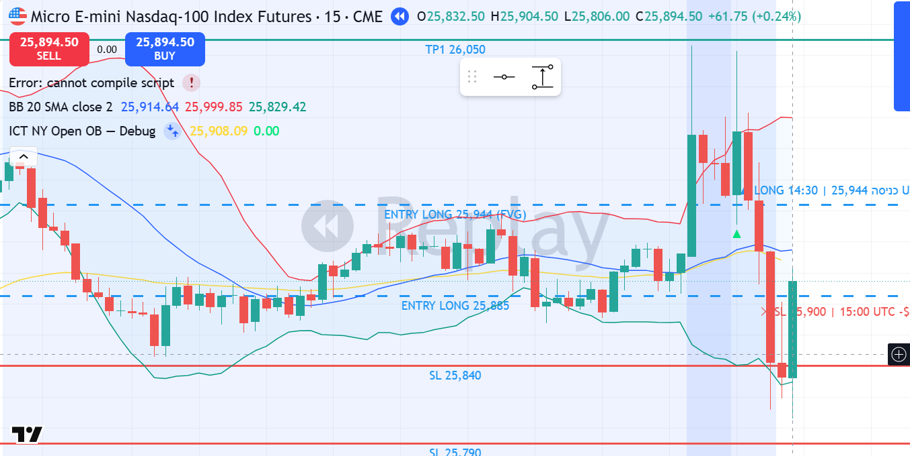

# MNQ1! LONG — 13.01.2026 [Replay Simulation]

## פרמטרים
- Entry: 25,944 | SL: 25,900 | TP1: 26,150
- R:R מתוכנן: 4.7:1 | סיכון: ~0.88% קפיטל דמו
- חוזים: 5 | Timeframe ביצוע: 15M | Kill Zone: NY Open (13:30 UTC)
- סוג כניסה: Limit Order — Bullish FVG Bottom 25,912–25,944
- כניסה בשעה: 14:30 UTC | 09:30 ET
- יציאה בשעה: 15:00 UTC | 10:00 ET — SL

## P&L
- סגירה: **SL** במחיר 25,900
- חוזים: **5 MNQ** | הפסד: 44 נק' × $2 × 5 = **-$440**
- נקודות: **-44 נק'**
- R realized: **-1R**
- שווי תיק אחרי עסקה: **$49,344**

## ניתוח שהוביל להחלטה

**מאקרו (4H):**
- Bias: BULLISH — Markup Phase, BOS bullish מ-Jan 7/8
- Higher Highs: 25,803 → 25,998 → 25,968 → 26,046
- Pullback ל-25,632 (Bullish OB 4H) → Bounce חזרה ל-25,960

**מבנה (1H):**
- Bullish FVG מ-NY Open Jan 12: 25,750–25,834
- NY Open Jan 13 Displacement: 25,910 → 26,046 בנר אחד (136 נק', 54K נפח)
- Bullish FVG חדש: 25,912–25,944

**ביצוע (15M):**
- FVG Bottom retest ב-25,944 — כניסה מדויקת
- SL: 25,900 (44 נק', מתחת ל-OB)
- בר הכניסה: O:25,950 → H:26,043 → L:25,930 → C:25,991, נפח 135K

**Red Flags שהתעלמנו מהם:**
- ⚠️ מחיר בDISTRIBUTION zone — מרובי sweeps של 26,000
- ⚠️ Wyckoff UTAD pattern — שלושה sweeps (26,046, 26,003, 26,043) ללא החזקה מעל 26,000

## מה קרה בפועל
מחיר עשה NY Open Displacement שורי ל-26,046 (sweep BSL 25,998), ואז retest לתוך ה-FVG 25,912–25,944. נכנסנו LONG ב-25,944. גם בר הכניסה עצמו שוב sweepאר ל-26,043 ואז חזר ל-25,991. לאחר מכן נפילה חדה: 25,892 → 25,811 → 25,806. ה-SL ב-25,900 נפגע על בר 15:00 UTC עם נפח 109K.

זה היה UTAD קלאסי — מחיר ניקה BSL שלוש פעמים ואז מוסדיים מכרו בחוזקה.

*▲ Entry LONG 25,944 | SL 25,900 | ✕ SL 15:00 UTC — UTAD Pattern*

## לקחים
- **מה עבד:** זיהוי FVG נכון, כניסה מדויקת, SL בוצע בלי הזזה ✅
- **מה לשפר:** כאשר מחיר עושה מרובי sweeps של BSL ואינו מחזיק — זהו UTAD/Distribution, לא Markup continuation
- **כלל חדש:** אם מחיר עשה 3+ sweeps מעל רמת BSL ולא סגר מעלה בבר ה-15M → RED FLAG לDistribution. לחפש שורט, לא לונג
- **משמעת:** SL לא הוזז, לא נפתחה עסקת נקמה ✅ — 2 SL ביום: עצור לפי כלל FASE 8
