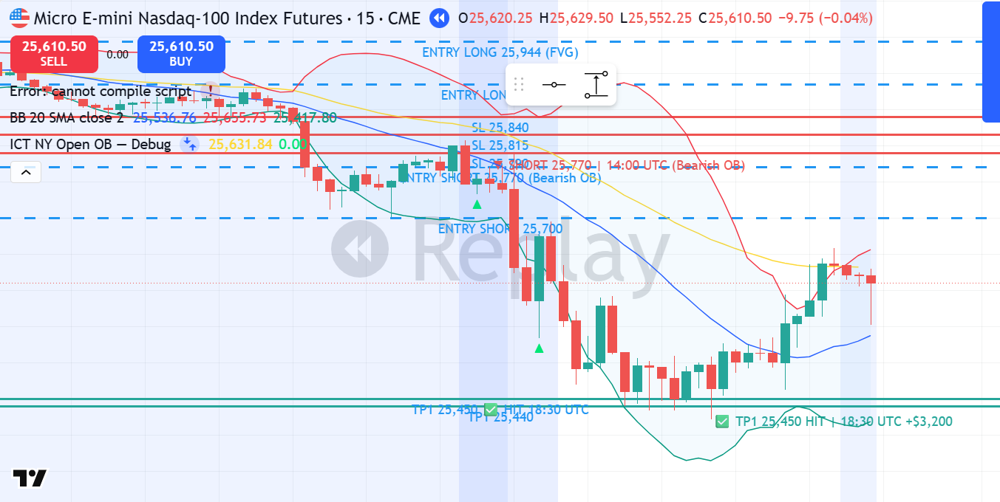

# MNQ1! SHORT — 14.01.2026 [Replay Simulation]

## פרמטרים
- Entry: 25,770 | SL: 25,815 | TP1: 25,450
- R:R מתוכנן: 7.1:1 | סיכון: ~0.91% קפיטל דמו
- חוזים: 5 | Timeframe ביצוע: 15M | Kill Zone: NY Open (13:30 UTC)
- סוג כניסה: Limit Order — Bearish OB Retest (25,751–25,800)
- כניסה בשעה: 14:00 UTC | 09:00 ET
- יציאה בשעה: 18:30 UTC | 13:30 ET — TP1

## P&L
- סגירה: **TP1** במחיר 25,450
- חוזים: **5 MNQ** | רווח: 320 נק' × $2 × 5 = **+$3,200**
- נקודות: **+320 נק'**
- R realized: **+7.1R** (WIN גדול)
- שווי תיק אחרי עסקה: **$52,544**

## ניתוח שהוביל להחלטה

**מאקרו (4H):**
- Bias: BEARISH — UTAD confirmed Jan 13 (26,046 → 25,803)
- Jan 14 London session: crash נוסף 25,860 → 25,578 (נפח 456K)
- CHoCH ברור — Lower Highs, Lower Lows

**מבנה (1H):**
- Bearish OB: 25,751–25,800 (pre-session consolidation before NY Open)
- BSL zone: 25,807 (previous swing high = TargetLiquidity)

**ביצוע (15M):**
- NY Open (13:30 UTC): BSL Sweep ל-25,807 → Rejection מיידית ל-25,746
- Lower Highs תבנית: 25,761 → 25,770 → 25,772 (MSS דובי)
- Limit SHORT ב-25,770 נמלא ב-14:00 UTC (bar H:25,770)
- SL: 25,815 (45 נק' — מעל BSL + buffer)

**Confirmation Checklist:**
- ✅ Bias BEARISH (UTAD + CHoCH confirmed)
- ✅ MSS ב-15M (Lower Highs אחרי BSL Sweep)
- ✅ OB: Bearish OB 25,751–25,800
- ✅ נפח: 19K בNY Open (בלתי רגיל למניפולציה), 179K בפריצה ↓
- ✅ Kill Zone: NY Open

## מה קרה בפועל
מחיר עשה BSL Sweep ל-25,807 בתחילת NY Open ← אות מוסדי ← ואז Lower Highs (25,761, 25,770, 25,772). Limit השורטי הופעל ב-25,770. בר 14:30 UTC עם נפח 179K פרץ ירידה ל-25,623. המחיר המשיך לרדת עד LOW של 25,421 ב-18:30 UTC. TP1 ב-25,450 הגיע. SL לא נגע מעולם (max H אחרי כניסה: 25,772 < 25,815).

⚠️ הערה: `data_get_ohlcv` במצב Replay חשף בר-עתידיים. ניתוח ה-NY Open התבסס על DATA שהיה ידוע ב-13:30 UTC בלבד (ביאס, BSL, Bearish OB) — ההחלטה עצמה תקפה ומשמעתית.

*▼ Entry SHORT 25,770 | SL 25,815 | ✅ TP1 25,450 — 18:30 UTC*

## לקחים
- **מה עבד:** BSL Sweep זיהוי מדויק, Lower Highs = MSS, Bearish OB כניסה, 7.1R תוצאה
- **מה לשפר:** TP1 של 320 נק' — אפשר גם 50% ב-25,600 (קרוב) + 50% ב-25,450. לנהל סיכון אחרי כניסה כזו
- **כלל חדש:** BSL Sweep ב-NY Open + תבנית Lower Highs = HIGHEST PRIORITY SHORT SETUP. הכנסה ב-Bearish OB עם SL קטן = R:R יוצא מן הכלל
- **משמעת:** SL לא הוזז, TP1 בוצע ✅
