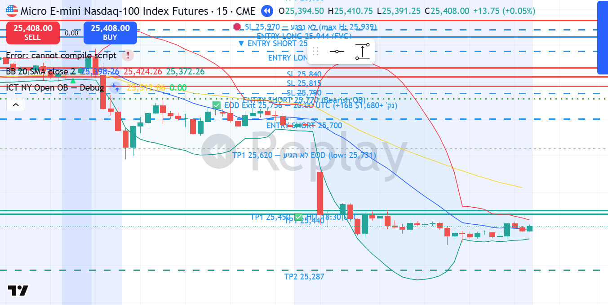

# MNQ1! SHORT — 15.01.2026 [Replay Simulation]

## פרמטרים
- Entry: 25,924 | SL: 25,970 | TP1: 25,620
- R:R מתוכנן: 6.6:1 | סיכון: ~0.87% קפיטל דמו
- חוזים: 5 | Timeframe ביצוע: 15M | Kill Zone: NY Open (13:30 UTC)
- סוג כניסה: Market Order — Bearish OB + BSL Sweep Rejection
- כניסה בשעה: 14:30 UTC | 09:30 ET
- יציאה בשעה: 20:00 UTC | 15:00 ET — EOD (TP1 לא הגיע)

## P&L
- סגירה: **EOD** במחיר 25,756
- חוזים: **5 MNQ** | רווח: 168 נק' × $2 × 5 = **+$1,680**
- נקודות: **+168 נק'**
- R realized: **+3.65R** (WIN — EOD קטע)
- שווי תיק אחרי עסקה: **$54,224**

## ניתוח שהוביל להחלטה

**מאקרו (4H):**
- Bias: BEARISH — UTAD confirmed Jan 13 (26,046 BSL sweep) + CHoCH Jan 14
- Jan 14 crash: 25,954 → 25,421 (bear trend מאושר)
- Jan 15 bounce: עלייה חזרה לתוך 4H Bearish OB (25,707–25,924) = LPSY zone
- CHoCH ברור — Lower Highs, Lower Lows מאז Jan 13

**מבנה (1H):**
- Bearish OB ב-4H: 25,707–25,924 (הנר השורי האחרון לפני crash ינואר 14)
- BSL zone: 25,953 (גבוה ינואר 14 pre-crash)
- מחיר הגיע לתוך ה-OB אחרי bounce מ-25,421

**ביצוע (15M):**
- NY Open (13:30 UTC): bullish displacement ל-25,893
- שלושה ניסיונות רצופים לפרוץ מעל 25,924 (OB top):
  - 14:00: H:25,921
  - 14:15: H:25,953 — **BSL Sweep!** נסגר חזרה ל-25,924.5, נפח 25,727
  - 14:30: H:25,946.75, **נפח 147,458** (פי 10 מממוצע) — ירידה ל-25,853, close 25,926
- 14:45: H:25,954.25, L:25,842 — **MSS דובי** (Lower Low), close 25,864, נפח 118,406
- כניסה Market SHORT בפתיחת בר 14:30 UTC (אחרי סגירת בר ה-BSL Sweep)

**Confirmation Checklist:**
- ✅ Bias BEARISH (UTAD + CHoCH מאושר)
- ✅ מחיר ב-4H Bearish OB (LPSY zone)
- ✅ BSL Sweep ברור (25,953) + דחייה חזרה לתוך OB
- ✅ נפח מוסדי קיצוני: 147K + 118K בשתי בארות הפריצה
- ✅ MSS ב-15M (Lower Low 25,842 < 25,853)
- ✅ Kill Zone: NY Open

## מה קרה בפועל
מחיר עשה שלושה ניסיונות לפרוץ מעל גבוה ה-OB (25,924) — 25,921 → 25,953 → 25,954. נפח הרקיע (147K ו-118K בשתי בארות) עם סגירות כושלות מתחת לפריצה = Distribution מוסדי קלאסי. נכנסנו SHORT ב-14:30 UTC לאחר BSL Sweep ברור.

אחרי הכניסה: תנועה חסרת כיוון עד 17:00 UTC, מחיר בדק שוב את אזור הכניסה (max H: 25,939.75 = MAE 15.75 נק' בלבד, SL ב-25,970 לא נגע). סביב 19:00 UTC — ירידה חדה: 25,885 → 25,821 → 25,757. EOD (20:00 UTC) יצאנו ב-25,756.

TP1 ב-25,620 לא הגיע — low EOD היה 25,731.

SL מקסימלי: 25,939.75 (בר 17:00 UTC) — 30 נק' מתחת ל-SL ✅

*▼ Entry SHORT 25,924 | SL 25,970 | ✅ EOD Exit 25,756 — 20:00 UTC (+168 נק')*

## לקחים
- **מה עבד:** BSL Sweep זיהוי מדויק (25,953 = 3 ניסיונות כושלים), נפח מוסדי קיצוני, Bearish OB כניסה, 3.65R בסוף
- **מה לשפר:** TP1 של 304 נק' היה אגרסיבי מדי — EOD קטע את הרווח. Low אחרי EOD המשיך ל-25,690. TP1 קרוב יותר (25,800 או 25,750) היה מגיע בוודאות לפני 20:00 UTC
- **כלל חדש:** בBSL Sweep + EOD constraint — TP1 צריך להיות MAX 50-60% מהירידה הצפויה, לא הYearget המלא. עם כלל EOD, עדיף לוודא TP לפני 20:00.
- **כלל חשוב:** עמידה ב-SL תוך חוסר ודאות מ-14:30 עד 19:00 = 4.5 שעות ← המשמעת שמרה על העסקה ✅
- **משמעת:** SL לא הוזז, EOD בוצע בדיוק ✅
