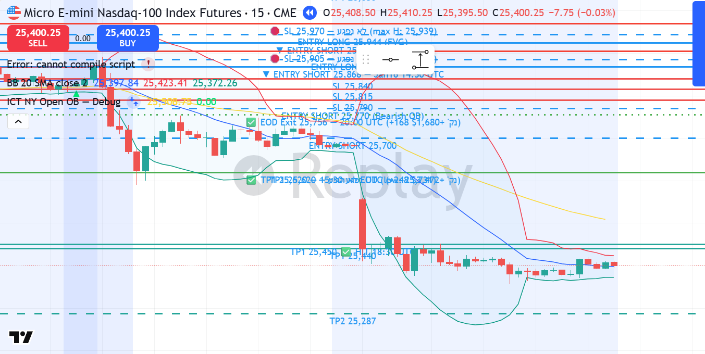

# MNQ1! SHORT — 16.01.2026 [Replay Simulation]

## פרמטרים
- Entry: 25,868 | SL: 25,905 | TP1: 25,620
- R:R מתוכנן: 6.7:1 | סיכון: ~0.96% קפיטל דמו
- חוזים: 7 | Timeframe ביצוע: 15M | Kill Zone: NY Open (13:30 UTC)
- סוג כניסה: Market Order — Bearish OB LPSY (Last Point of Supply)
- כניסה בשעה: 14:30 UTC | 09:30 ET
- יציאה בשעה: 15:30 UTC | 10:30 ET — TP1

## P&L
- סגירה: **TP1** במחיר 25,620
- חוזים: **7 MNQ** | רווח: 248 נק' × $2 × 7 = **+$3,472**
- נקודות: **+248 נק'**
- R realized: **+6.7R** (WIN גדול)
- שווי תיק אחרי עסקה: **$57,696**

## ניתוח שהוביל להחלטה

**מאקרו (4H):**
- Bias: BEARISH — UTAD מאושר Jan 13, CHoCH מאושר Jan 14-15
- Lower Highs + Lower Lows מאז Jan 13: 26,046 → 25,954 → 25,891
- מחיר עדיין בתוך 4H Bearish OB (25,707–25,924) = LPSY zone מתמשכת

**מבנה (1H):**
- Bearish OB: 25,707–25,924 (גבוה Jan 14 pre-crash, נוגע שוב)
- SSL Target: 25,620 (Jan 15 London session lows = Sell Side Liquidity)
- Jan 15 EOD close: 25,756 — מחיר ב-Premium zone יחסית לתיחום הדובי

**ביצוע (15M):**
- Jan 16 NY Open (13:30 UTC): displacement קטן ל-25,838, נפח 12K (נמוך יחסית)
- 14:15 UTC: Push ל-25,878 עם נפח 30,674 — כניסה לאזור ה-OB
- 14:30 UTC: **נר ה-LPSY** — O:25,868, H:25,891, L:25,817, C:25,820, נפח 104,666
  - הגיע ל-25,891 (Lower High ביחס ל-25,924/25,954) → Rejection חד עם נפח מוסדי
  - סגר 48 נקודות מתחת לשיא = Distribution ברורה
- כניסה Market SHORT בפתיחת בר 14:30 UTC

**Confirmation Checklist:**
- ✅ Bias BEARISH (UTAD + CHoCH, Lower Highs continuous)
- ✅ מחיר ב-4H Bearish OB — שלישי ב-3 ימים (Jan 14, 15, 16) = LPSY pattern
- ✅ Lower High (25,891 < 25,954 < 26,046) = MSS הולך ומעמיק
- ✅ נפח מוסדי בבר הכניסה: 104,666 (פי 8+ מממוצע NY Open)
- ✅ Kill Zone: NY Open
- ✅ SSL ברורה ל-TP1: 25,620 (Jan 15 London lows = מגנט נזילות)

## מה קרה בפועל
NY Open נכשל לפרוץ מעל 25,878. בבר 14:30 UTC נפח של 104K פרץ את המחיר ל-25,891 (Lower High = LPSY קלאסי) ואז ירידה חדה ל-25,817 בתוך אותו הבר — Distribution ברורה. נכנסנו SHORT בפתיחת הבר (25,868).

מיד אחרי: נפילה רצופה —
- 14:45: ל-25,726 (-142 נק')
- 15:00: ל-25,709 (-159 נק')
- 15:15: ל-25,662 (-206 נק')
- 15:30: LOW 25,590 ← TP1 ב-25,620 הגיע! ✅

SL ב-25,905 לא נגע מעולם — max H אחרי כניסה: 25,891 = 23 נק' adverse בלבד.

TP1 הגיע תוך שעה בדיוק מהכניסה. נקי, מהיר, חסר עכבות.

*▼ Entry SHORT 25,868 | SL 25,905 | ✅ TP1 25,620 — 15:30 UTC (+248 נק', 6.7R)*

## לקחים
- **מה עבד:** LPSY זיהוי מדויק — שלושה ניסיונות כושלים של ה-Bearish OB (Jan 14, 15, 16) = תבנית ממשיכה. נפח 104K = אות Distribution מיידי. TP1 הגיע תוך שעה
- **מה לשפר:** עם כניסה כזו נקייה (104K rejection), שקול 2-3 חוזים נוספים ל-TP2 (25,400 area). הנפילה המשיכה ל-25,590 — 30 נק' מעל TP1 האפשרי
- **כלל חדש:** LPSY pattern = כשהמחיר בודק OB bearish פעם 3+ ברצף ימים עוקבים עם Lower High כל פעם + נפח — הכניסה הכי נקייה. R:R צפוי 6:1+ עם SL קטן
- **כלל מאושר:** Short + LPSY + EOD constraint → TP1 קרוב (250-300 נק') הגיוני. לא לתכנן TP1 מעבר ל-350 נק' בסשן בודד
- **משמעת:** SL לא הוזז, TP1 בוצע ✅ — שמירה על כל כללי FASE ✅
