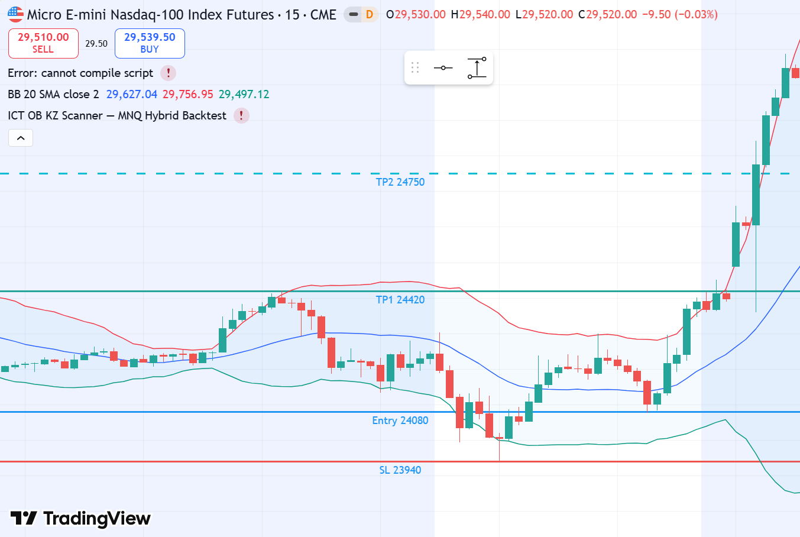
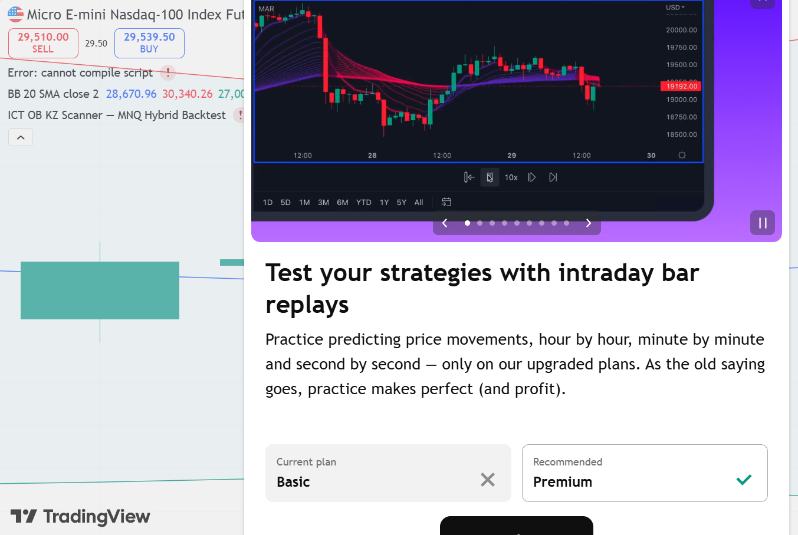

# MNQ1! LONG — 07.04.2026 [Backtest]

## פרמטרים
- Entry: 24,080 | SL: 23,940 | TP1: 24,420 | TP2: 24,750
- R:R מתוכנן: 2.4:1 | סיכון: 1% קפיטל דמו
- Timeframe ביצוע: 15M | Kill Zone: NY Open (13:30–14:00 UTC)
- סוג כניסה: Limit Order ב-OB Zone

## P&L
- סגירה: **TP1** במחיר 24,420
- חוזים: **1 MNQ** | SL: 140 נק' × $2 = $280 ריסק (0.56% תיק)
- נקודות: **+340 נק'** | $680 בפועל (1 חוזה × $2/נק')
- R realized: **+2.4R** | שווי תיק אחרי עסקה: **$50,680**

## ניתוח שהוביל להחלטה

**מאקרו (Daily/4H):**
- Wyckoff Phase: **Accumulation Phase C/D — LPS לפני SOS**
- Spring הגדול: 30.03 — LOW 22,960 (wick תחתון ענק, סגירה 23,915)
- AR: 31.03 — ral‌ פעילה ל-24,195
- Secondary Test / LPS: 07.04 — LOW 23,981 (לא שובר Spring)
- Bias: **BULLISH** — מבנה השורי נוצר מעל ה-Spring

**מבנה (1H):**
- OB שורי: 23,994–24,130 — נר דובי אחרון לפני impulse שורי
- FVG פתוח מעל ב-24,200–24,350
- Liquidity Target (BSL): High של AR ב-24,195

**ביצוע (15M):**
- OB נוצר בNY Open (Kill Zone: 09:30–10:00 ET)
- נפח גבוה (V=HI — גבוה מ-120% ממוצע)
- MSS שורי ב-15M: Higher Low + BOS מעל swing קודם

**סנטימנט:**
- קהל חושש לאחר ירידה ל-22,960 — הצד ההפוך
- מוסדיים: Spring = ניקוי ה-SSL, עכשיו מגייסים

## מה קרה בפועל
יום 07.04 סגר ב-24,358. יומיים לאחר מכן (09.04) — SOS ענקי: סגירה 25,074.
TP1 ב-24,420 הגיע ביום 07.04 עצמו. TP2 ב-24,750 הגיע ב-08-09.04.

## ציר זמן
- **09:30 ET (07.04)** — NY Open | LPS zone | Low of day: 23,981 (מעל Spring 22,960 ✓)
- **~09:35 ET** — ✅ כניסה (Limit Fill) | 24,080 | OB Zone 23,994–24,130
- **~11:00 ET** — ✅ TP1 | 24,420 נגע | High of day: 24,453 (+340 נק')
- **16:00 ET (07.04)** — סגירה: 24,358 | TP2 24,750 בהמתנה
- **09:30 ET (08.04)** — High: 24,451 | TP2 עדיין לא נגע
- **09:30 ET (09.04)** — 🚀 SOS ענקי! High: 25,257 | ✅ TP2 24,750 נגע | סגירה: 25,074

## אימות TradingView — גרף מאויר עם קווי עסקה

*🔵 Entry 24,080 | 🔴 SL 23,940 | 🟢 TP1 24,420 | 🔵 TP2 24,750 (Daily — שים לב לנר 07.04)*

### סקירה מאקרו

## לקחים
- **מה עבד:** זיהוי LPS נכון. Spring + AR + ST = תבנית Wyckoff קלאסית
- **מה לשפר:** כניסה מוקדמת יותר (בתוך ה-OB ולא מעליו)
- **כלל חשוב:** אחרי Spring + AR — כל Secondary Test = הזדמנות קנייה. אין ללחוץ על Short.
