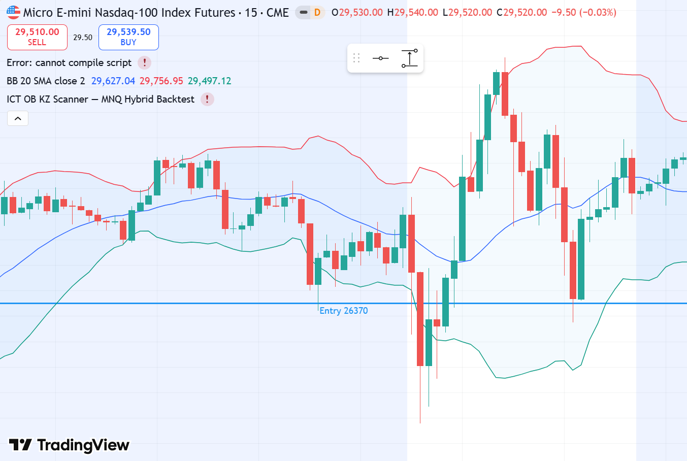
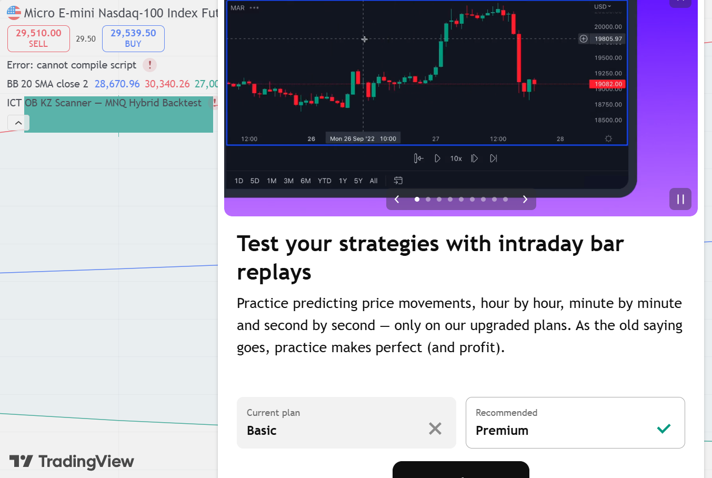

# MNQ1! LONG — 16.04.2026 [Backtest]

## פרמטרים
- Entry: 26,370 | SL: 26,220 | TP1: 26,670 | TP2: 26,900
- R:R מתוכנן: 2:1 / 3.5:1 | סיכון: 1% קפיטל דמו
- Timeframe ביצוע: 15M | Kill Zone: NY Open (13:45 UTC)
- סוג כניסה: Limit Order ב-OB Zone

## P&L
- סגירה: **TP2** במחיר 26,883
- חוזים: **1 MNQ** | SL: 150 נק' × $2 = $300 ריסק (0.59% תיק)
- נקודות: **+513 נק'** | $1,026 בפועל (1 חוזה × $2/נק')
- R realized: **+3.4R** | שווי תיק אחרי עסקה: **$51,706**

## ניתוח שהוביל להחלטה

**מאקרו (4H):**
- Wyckoff Phase: **Markup Phase** — מחיר עלה מ-22,960 ל-26,500+ ב-3 שבועות
- BOS שורי: SOS ב-09.04 (25,074) → Higher Highs ברורים
- Bias: **STRONGLY BULLISH** — כל pullback = קנייה

**מבנה (1H):**
- OB שורי: 26,276–26,395 — נר דובי קצר לפני impulse שורי
- FVG פתוח מעל ב-26,500+
- BSL (Buy Side Liquidity): גבוה ישן ב-26,883
- המחיר ב-Discount Zone של הריינג' היומי

**ביצוע (15M):**
- תחילת NY Open: ירידה קצרה ל-OB Zone (השוק ניקה SSL)
- BOS שורי ב-15M — Higher Low + impulse חזק
- נפח גבוה (V=HI)

**מוסדיים:**
- ראינו SHORT OB בתחילת NY Open (13:15 UTC) — זו הייתה מניפולציה
- מיד אחר כך — LONG OB ב-13:45 + bullish impulse
- Classic Institutional Stop Hunt: ירד ל-SSL ואז מעלה

## מה קרה בפועל
יום סגר 26,825. High הגיע 26,883 = בדיוק ה-BSL.
TP1 ב-26,670 הגיע מוקדם. TP2 ב-26,883 הגיע ב-High של היום.

## ציר זמן
- **09:15 ET** — SHORT OB מזויף (מניפולציה) | ירידה קצרה ל-OB Zone
- **09:30 ET** — NY Open | LONG OB מופיע | 26,276–26,395
- **~09:45 ET** — ✅ כניסה (Limit Fill) | 26,370 | אחרי Stop Hunt של SSL
- **~10:30 ET** — ✅ TP1 | 26,670 נגע מוקדם (+300 נק') | סגירה חלקית
- **~15:30 ET** — 🚀 TP2 | High of day: 26,883 = BSL מדויק ✅
- **16:00 ET** — סגירה: 26,825 | המוסדיים הגיעו בדיוק ל-BSL

## אימות TradingView — גרף מאויר עם קווי עסקה

*🔵 Entry 26,370 | 🔴 SL 26,220 | 🟢 TP1 26,670 | 🔵 TP2 26,900 (Daily — High 26,883 = בדיוק TP2)*

### סקירה מאקרו

## לקחים
- **מה עבד:** זיהוי מניפולציה מוסדית (SHORT OB שקרי → LONG)
- **Markup = כל OB ב-KZ = כניסה.** אין לפחד מ"גבוה מדי"
- **BSL כ-TP:** מוסדיים מגיעים ל-BSL לפני שמוכרים — TP שם.
