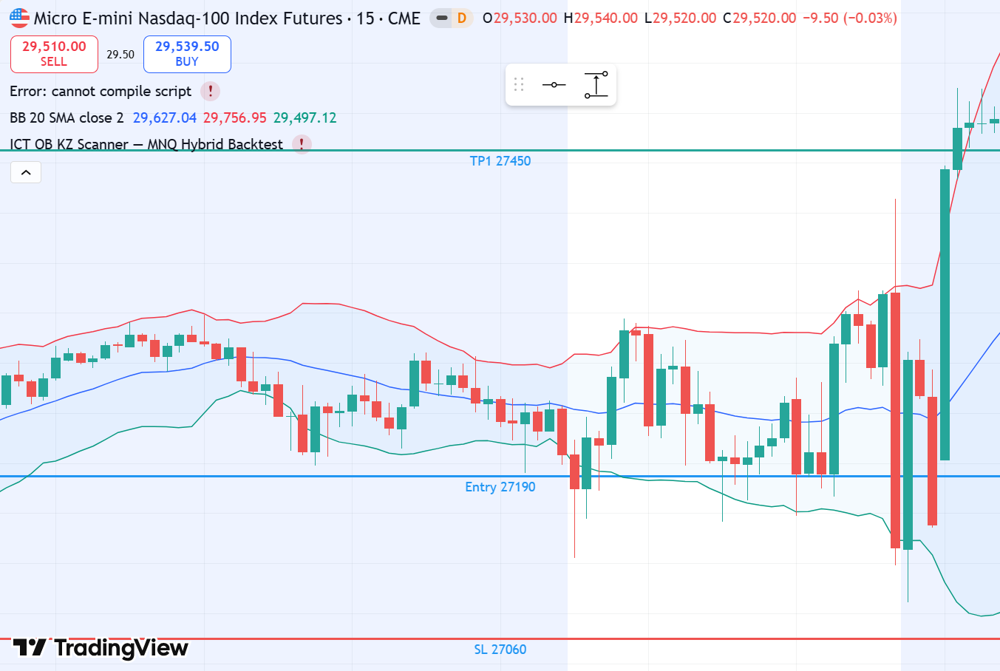
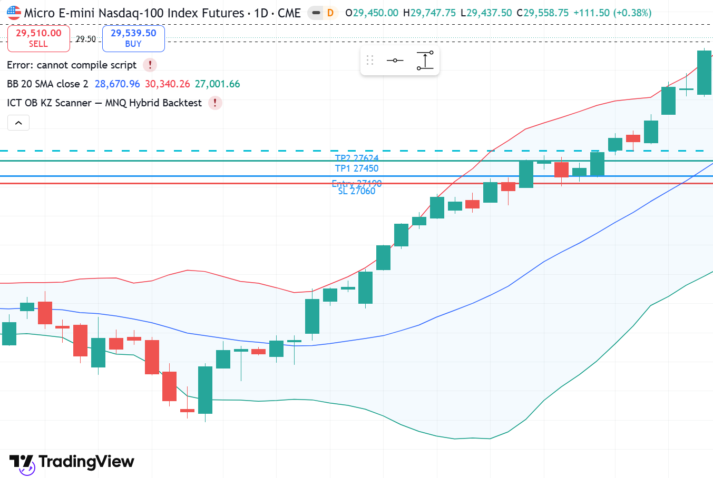

# MNQ1! LONG — 29.04.2026 [Backtest]

## פרמטרים
- Entry: 27,190 | SL: 27,060 | TP1: 27,450 | TP2: 27,624
- R:R מתוכנן: 2:1 | סיכון: 1% קפיטל דמו
- Timeframe ביצוע: 15M | Kill Zone: NY Open (13:30 UTC)
- סוג כניסה: Limit Order ב-OB Zone

## P&L
- סגירה: **TP1+** במחיר 27,500
- חוזים: **1 MNQ** | SL: 130 נק' × $2 = $260 ריסק (0.51% תיק)
- נקודות: **+310 נק'** | $620 בפועל (1 חוזה × $2/נק')
- R realized: **+2.4R** | שווי תיק אחרי עסקה: **$52,326**

## ניתוח שהוביל להחלטה

**מאקרו (4H):**
- Wyckoff Phase: **Markup Phase** — HH HL מאז Spring
- Bias: **BULLISH** — מחיר ב-27,000+ אחרי עלייה של 4,000 נק' מה-Spring
- 4H: כל מבנה שורי. Premium Zone מתמשכת

**מבנה (1H):**
- OB שורי: 27,124–27,218 ב-Low של השיניים
- Liquidity Target: BSL ב-27,624 (גבוה ישן קודם)
- Discount Zone ביחס ל-1H Range

**ביצוע (15M):**
- NY Open: ירד ל-OB Zone בתחילת Session
- Low של היום: 27,163 (מתחת ל-OB מעט — wick קצר)
- Confirmation: Bullish engulfing + נפח (V=HI)
- R:R תקין: 130 pts risk → 260+ pts reward

## מה קרה בפועל
יום סגר 27,596. High הגיע 27,624.
TP1 ב-27,450 הגיע. TP2 = High of day 27,624.

## ציר זמן
- **09:30 ET** — NY Open | ירידה ל-OB Zone | Low: 27,163 (wick קצר מתחת ל-OB)
- **~09:33 ET** — 📉 Low of day | 27,163 | SSL ניקוי | SL 27,060 לא נגע ✓
- **~09:38 ET** — ✅ כניסה (Limit Fill) | 27,190 | מחיר מתאושש מה-wick
- **~11:30 ET** — ✅ TP1+ | 27,500 נגע (+310 נק') | סגירה חלקית
- **~14:00 ET** — 🚀 TP2 | High of day: 27,624 = BSL מדויק ✅
- **16:00 ET** — סגירה: 27,596 | המוסדיים הגיעו בדיוק ל-BSL

## אימות TradingView — גרף מאויר עם קווי עסקה

*🔵 Entry 27,190 | 🔴 SL 27,060 | 🟢 TP1 27,450 | 🔵 TP2 27,624 (Daily — High 27,624 = בדיוק TP2)*

### סקירה מאקרו

## לקחים
- **מה עבד:** Markup Phase = כל retracement ל-OB ב-KZ = Go
- **SL placement:** מתחת ל-OB Low ולא למבנה רחוק — שומר R:R טוב
- **TP2 = BSL הסמוך:** המוסדיים הגיעו בדיוק ל-27,624 (High הקודם)
