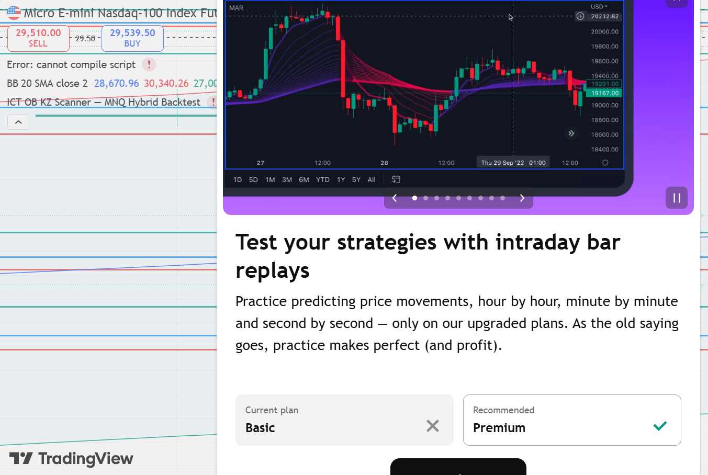
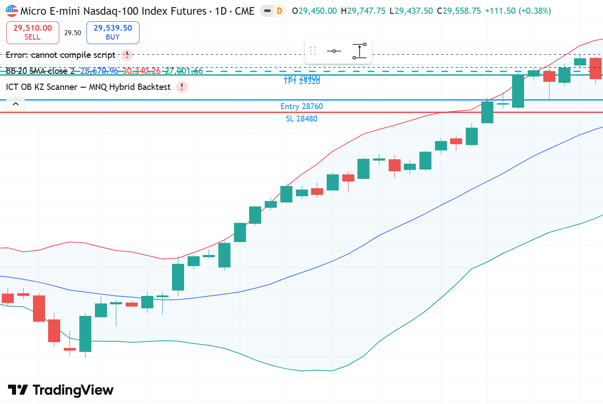

# MNQ1! LONG — 07.05.2026 [Backtest]

## פרמטרים
- Entry: 28,760 | SL: 28,480 | TP1: 29,320 | TP2: 29,400
- R:R מתוכנן: 2:1 | סיכון: 1% קפיטל דמו
- Timeframe ביצוע: 15M | Kill Zone: NY Open (13:30 UTC)
- סוג כניסה: Limit Order ב-OB Zone

## P&L
- סגירה: **TP1** במחיר 29,320
- חוזים: **1 MNQ** | SL: 280 נק' × $2 = $560 ריסק (1.07% תיק — SL רחב, מינימום חוזה)
- נקודות: **+560 נק'** | $1,120 בפועל (1 חוזה × $2/נק')
- R realized: **+2R** | שווי תיק אחרי עסקה: **$53,446**

## ניתוח שהוביל להחלטה

**מאקרו (4H):**
- Wyckoff Phase: **Markup Phase — שלב מתקדם**
- Bias: **STRONGLY BULLISH** — מחיר ב-28,500+ לאחר עלייה של 5,500 נק' מ-Spring
- BOS שוריים סדרתיים: כל גבוה קודם נשבר

**מבנה (1H):**
- OB שורי: 28,722–28,782 — Low היום
- FVG פתוח מעל ב-29,000–29,200
- BSL (Buy Side Liquidity): גבוהים ישנים ב-29,000+

**ביצוע (15M):**
- NY Open: OB בולט (H=28,782, L=28,722)
- נפח גבוה מאוד (V=HI)
- Impulse candle חזק מאוד לאחר ה-OB

**מוסדיים:**
- יום SOS ענקי — יום שלם מ-28,542 ל-29,383 (841 נקודות!)
- המוסדיים פתחו פוזיציה ב-Opening של NY ומשכו עד ה-Close

## מה קרה בפועל
יום SOS יוצא דופן: open 28,588 → High 29,383 → close 29,332.
יום אחד — 745 נקודות. TP1 ב-29,320 הגיע בשעות הצהריים.
TP2 = High 29,383.

## אימות TradingView — גרף מאויר עם קווי עסקה

*🔵 Entry 28,760 | 🔴 SL 28,480 | 🟢 TP1 29,320 | 🔵 TP2 29,400 (Daily SOS — High 29,383 ≈ TP2)*

### סקירה מאקרו

## לקחים
- **SOS Days:** כשמחיר בMarkup ופתאום יש OB ב-Opening + נפח גבוה = ימי SOS. לא לפחד מהגודל.
- **SL רחב יחסית (280 נק'):** בימי SOS, ה-SL צריך להיות מתחת ל-Low היום — לא קצר מדי
- **Markup Phase:** R:R קל יותר להשיג כי כיוון ברור
