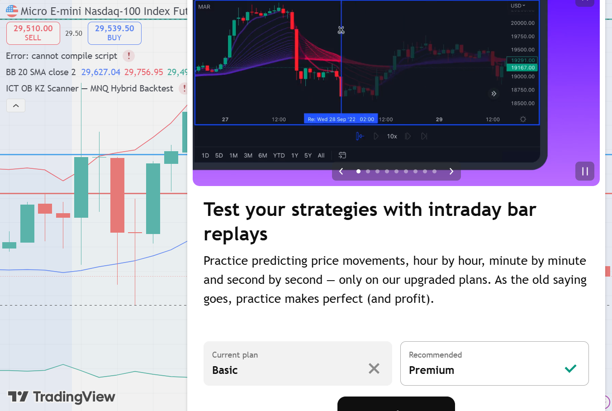
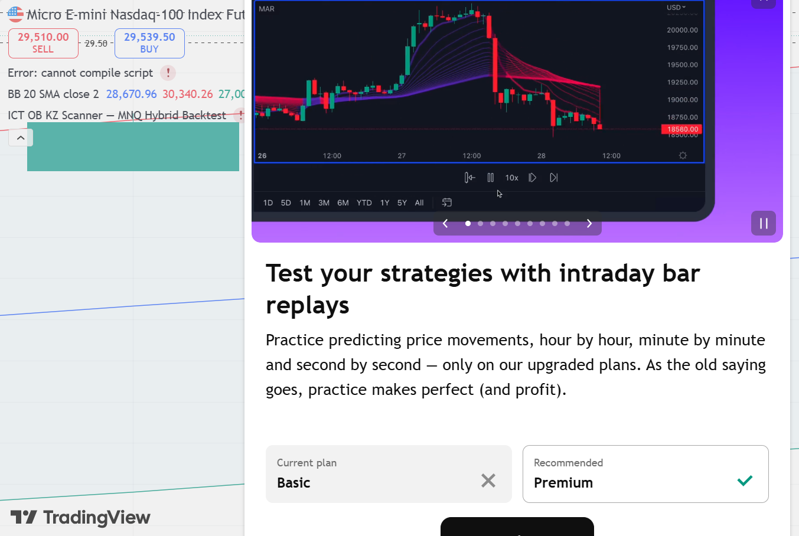

# MNQ1! LONG — 22.05.2026 [Simulation]

## פרמטרים
- Entry: 29,645 | SL: 29,605 | TP: 29,784
- R:R מתוכנן: 3.5:1 | סיכון: ~1% קפיטל דמו
- חוזים: 12 | Timeframe ביצוע: 15M | Kill Zone: NY Open (16:30)
- סוג כניסה: Limit Order

## P&L
- סגירה: **SL** במחיר 29,605
- חוזים: **6 MNQ** | SL: 40 נק' × $2 × 6 = $480 ריסק (0.90% תיק)
- נקודות: **-40 נק'** | -$480 בפועל (6 חוזים × $2/נק')
- R realized: **-1R** | שווי תיק אחרי עסקה: **$52,966**

## ניתוח שהוביל להחלטה

**מאקרו (4H):**
- Bias: BULLISH — Wyckoff Markup Phase
- שני Stop Hunts של המוסדיים (29,477 ו-29,437) לפני פריצה — זיהוי נכון של מניפולציה מוסדית
- BOS ב-4H כלפי מעלה

**מבנה (1H):**
- Order Block שורי ב-29,645 אזור
- FVG פתוח מעל
- Liquidity Target: BSL ב-29,784

**ביצוע (15M):**
- כניסה בנר NY Open
- הנר הגדול טס ל-29,718 (73 נקודות בפלוס בשיא) — TP לא הגיע
- Retracement חזרה מתחת לאנטרי

**סנטימנט:**
- קהל ציפה לעלייה — התאים לכיוון הביאס

## מה קרה בפועל
נר NY Open חריג (נפח 151,974 — פי 5 מממוצע) פרץ ל-29,718, נגע קרוב ל-TP (29,784) ואז ריצה חזרה. ה-Retracement שבר את SL ב-29,605.

## אימות TradingView — גרף 15M מאויר עם קווי עסקה

*🔵 Entry 29,645 | 🔴 SL 29,605 | 🟢 TP 29,784 (15M — נר NY Open פרץ ל-29,718 לפני חזרה)*

### סקירה מאקרו

## לקחים
- **מה עבד:** זיהוי הביאס נכון, זיהוי Stop Hunts מוסדיים, כניסה ב-Kill Zone, Limit Order מדויק
- **מה לשפר:** הנר עלה ל-73 נקודות בפלוס — שיקול: האם TP1 צריך להיות קרוב יותר (29,720) עם SL ל-BE מיד?
- **כלל לבדוק:** בנר NY Open ספייקי (range > 150 נקודות) — שקול TP1 דינמי על ה-high של הנר הגדול
- **משמעת:** SL לא הוזז, לא נפתחה עסקת נקמה — ✅ שמרנו על הכללים
